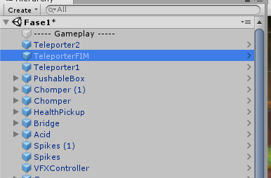
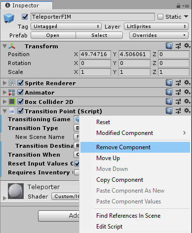
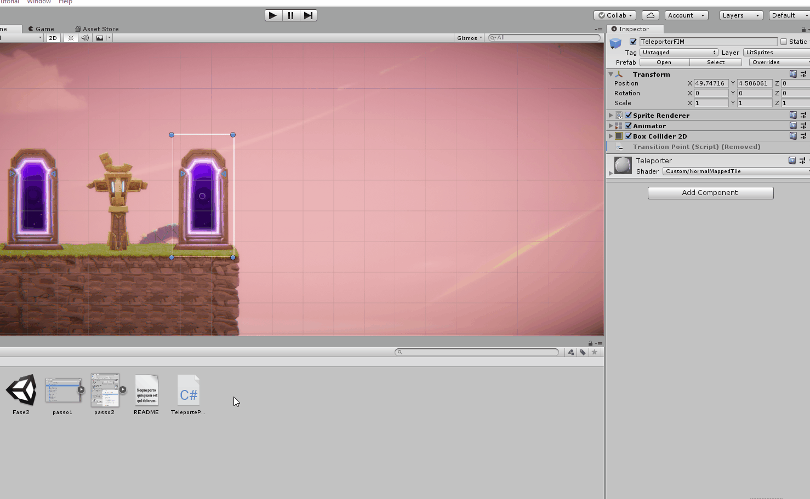
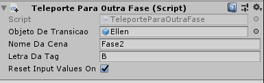
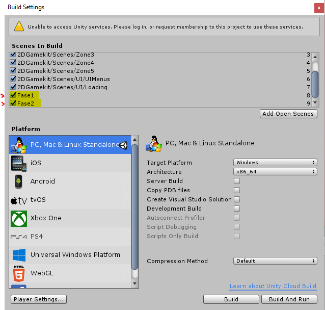

# Mudando de cena

Aparentemente algumas pessoas estão com o script TransitionPoint corrompido: algumas das opções demonstradas no video não aparecem. Isso tem alguma coisa a ver com as novas versões do Unity, como confirmado por alguns membros do forum.

Por enquanto, para resolver o problema, criei o script TeleporteParaOutraCena.cs, que é uma versão menor do TransitionPoint.

**Se você é um dos azarados que teve problemas com o TransitionPoint, veja abaixo como resolver:**

Primeiro, selecione o TeleporterFIM na hierarquira do Unity:

No Inspector, no bloco onde está o transition point, clique na engrenagem e depois em "Remove Component":

Baixe o nosso script [TeleporteParaOutraFase.cs](TeleporteParaOutraFase.cs) e coloque na pasta de seu projeto, no Unity, arraste o script para dentro do TeleporterFIM:

Pronto! Agora configure as variáveis Nome da Cena e Letra da Tag conforme está no vídeo, com a diferença que, em vez de selecionar de uma caixa de seleção, você vai precisar escrever o nome da cena e a letra correspondente manualmente. Vai algo desse tipo:

**OBS:** Não se esqueça de ter as cenas no seu BuildSettings com check! Para ter certeza, vá em **File > Build Settings...** E veja se está assim:

